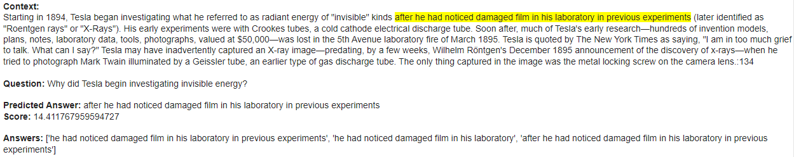
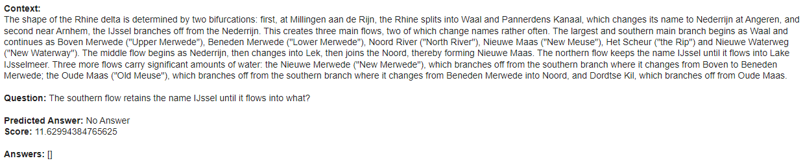
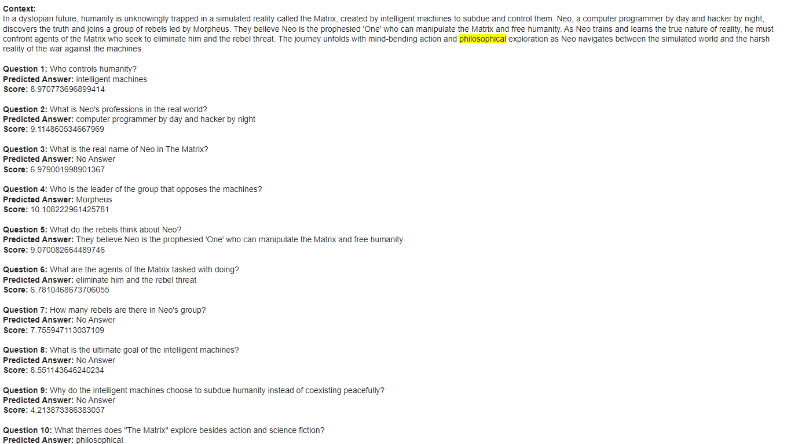
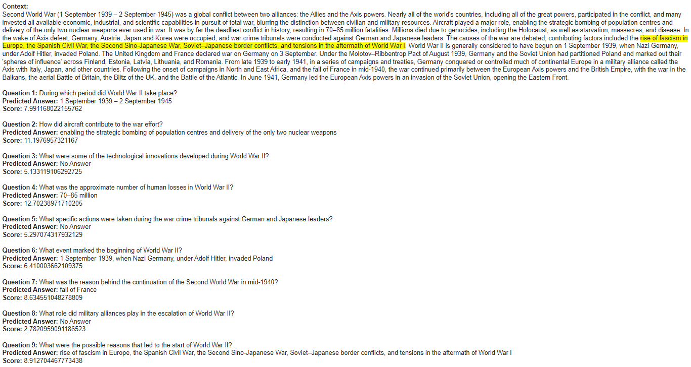

# <h1 align="center">**Question Answering**</h1>

 

This repository implements Question Answering models, a natural language processing (NLP) task that retrieves the answer to a question from a given text. These models are created using the TensorFlow and Hugging Face Transformers libraries. There are two types of this task:

1. **Extractive:** Extracts the answer directly from the provided context.
2. **Abstractive:** Generates a correct answer freely based on the context or without it.

## **Common Use Cases:**
- **Virtual Assistants:** Answering user questions using information from a specific database.
- **Document Search:** Finding precise answers in large document sets.
- **Customer Service:** Providing quick and accurate responses to customer inquiries.
- **Education:** Helping students get answers to questions based on study materials.

## **Implemented Models:**

- **Extractive Model for Answerable Questions:** This RoBERTa Large model has been fine-tuned with the [Stanford Question Answering Dataset (SQuAD)](https://huggingface.co/datasets/rajpurkar/squad) to appropriately answer questions within a given context. SQuAD consists of 100,000 question-answer pairs across more than 500 Wikipedia articles, where the answer is a text segment from the corresponding passage. The model has achieved an excellent **F1 Score** of **94.1%** on the validation set.

- **Extractive Model for Answerable and Unanswerable Questions:** This model is a more robust and challenging version of the previous one, fine-tuned with [SQuAD 2.0](https://huggingface.co/datasets/rajpurkar/squad_v2) to appropriately answer both answerable and unanswerable questions within the provided context. SQuAD 2.0 consists of the 100,000 question-answer pairs from SQuAD plus 50,000 unanswerable questions. The model is capable of responding to questions within the context and also returns ``No Answer`` if the answer is not in the context or if it is of an abstractive type. It has achieved an excellent **F1 Score** of **87.7%** on the validation set.

## **Some Results**

 

---

 

---

 

---

 

#### *Further results can be found in their respective notebooks.*

## **Technological Stack**
 

## **Contact**

